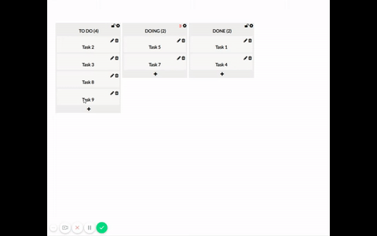

## React PHP Kanban Board

### Getting Started

These instructions will get you a copy of the project up and running on your local machine for development and testing purposes.

### Prerequisites

You need to have Node, PHP and Composer installed. I tested on Windows with <strong>Node 8</strong>, <strong>PHP 5.6</strong> and latest <strong>Google Chrome</strong>. Please take this into consideration because it seems on same platforms drag and drop is not working.

### Installing
```
git clone https://github.com/vesic/kanban-board
````

While developing I treated projects separately so we have two distinct installation paths.

#### Server

Database - create 'tasks_db' database and import api/tasks.sql file.

Setup .env file. Take a look at the .env.example.

```
cd api
composer install
php -S localhost:8080
open http://localhost:8080/api/tasks
```

#### REST API Endpoints

<table>
  <tr>
    <th>HTTP Method</th>
    <th>URI Path</th>
    <th>Description</th>
    <th>Payload Body</th>
  </tr>
  <tr>
    <td>GET</td>
    <td>api/tasks</td>
    <td>Get all tasks</td>
    <td></td>
  </tr>
  <tr>
    <td>GET</td>
    <td>api/tasks/{id}</td>
    <td>Find task by id</td>
    <td></td>
  </tr>
  <tr>
    <td>POST</td>
    <td>api/tasks</td>
    <td>Create new task</td>
    <td>{"name":"name","description":"",stage:1}</td>
  </tr>
  <tr>
    <td>DELETE</td>
    <td>api/tasks/{id}</td>
    <td>Destroy task</td>
    <td></td>
  </tr>
  <tr>
    <td>PUT</td>
    <td>api/tasks/{id}</td>
    <td>Update task</td>
    <td>{"name":"name","description":"",stage:1}</td>
  </tr>
</table>

#### Client
I've used yarn but you are free to choose npm. What is important is to stay consistent.

```
cd client
yarn install
yarn run db:seed
yarn serve // at this point script should launch the default browser
open http://localhost:3000
```

You can check json-server running in the background. This is for client development purposes only.
```
open http://localhost:3001/tasks
```
### Running the tests

#### Server

Make sure server side code is running.

```
cd api
vendor/bin/phpunit test
```

#### Client

Make user client side code is running.

```
cd client
npm run cypress:open
```
Click 'Run all specs'. Note that first time will be a little slower.

### Deployment

This deployment is not production ready. It is intended for demonstration purposes only. More complicated scenario including non development servers like Apache or Nginx would require more complex instructions.

```
sh deploy.sh
```

If above command fails for some reason one of which is that it is very simple please build client with
```
yarn build
```
copy content of this directory into the api dir and finally run
```
php -S localhost:80
open http://localhost/index.html
```

Note that you need to point to index.html for React to kick in. That can be solved with .htaccess file.

### Built With
* [Slim](https://www.slimframework.com) - Slim is a PHP micro framework
* [React](https://reactjs.org) - A JavaScript library for building user interfaces
* [Redux](https://redux.js.org) - Redux is a predictable state container for JavaScript apps.
* [json-server](https://github.com/typicode/json-server) - Get a full fake REST API with zero coding
* [axios](https://github.com/axios/axios) - Promise based HTTP client for the browser and node.js
* [cypress](https://www.cypress.io) - Fast, easy and reliable testing for anything that runs in a browser

#### Final Result 

sort of - window prompt and confirm were not recorded unfortunately

